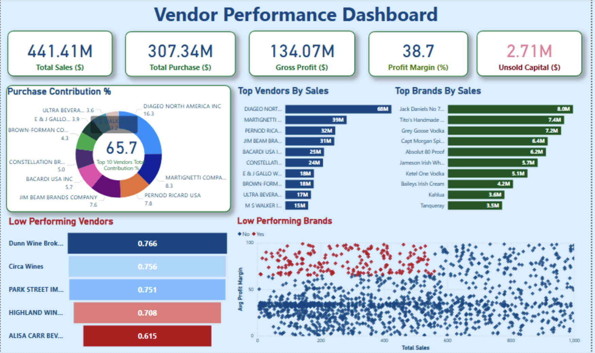

# Vendor Performance Analysis using Python and Power BI

## 📌 Overview
This project focuses on analyzing vendor performance based on sales data. It involves data ingestion, cleaning, exploratory data analysis (EDA), automation of summary generation, and dashboard development using Power BI. The project concludes with a comprehensive report containing actionable insights.

## 📂 Project Structure
```
├── data/
│   └── vendor_sales_summary.csv
├── notebooks/
│   ├── Exploratory Data Analysis.ipynb
│   └── Vendor Performance Analysis.ipynb
├── scripts/
│   ├── get_vendor_summary.py
│   └── ingestion_db.py
├── dashboard/
│   └── vendor_performance.pbix
├── reports/
│   └── Vendor Performance Report.pdf
|
|__ images
|    |_dashboard.png
|
└── README.md
```

## 🛠️ Tech Stack
- **Languages**: Python (Pandas, Matplotlib, Seaborn)
- **Tools**: Jupyter Notebook, Power BI, Excel
- **Other**: PDF Reporting

## 💡 Key Features
- Automated ingestion and cleaning of vendor sales data
- Detailed Exploratory Data Analysis (EDA) to identify trends and patterns
- Python scripts for automated vendor summary reports
- Interactive and visually rich dashboard built using Power BI
- Finalized insights compiled in a professional PDF report

## 🚀 How to Run
1. Clone the repository
2. Open Jupyter Notebook and run EDA and analysis notebooks in `/notebooks`
3. Use `get_vendor_summary.py` to generate vendor summary from data
4. Open `.pbix` file in Power BI for dashboard view
5. Review the final report in `/reports`

## 📈 Outputs
- Vendor performance summary CSV
- Power BI Dashboard
- Final insights PDF report

---
<h2><a class="anchor" id="dashboard"></a>Dashboard</h2>

- Power BI Dashboard shows:
  - Vendor-wise Sales and Margins
  - Inventory Turnover
  - Bulk Purchase Savings
  - Performance Heatmaps



---

## 📬 Contact
For queries or collaboration, feel free to connect via [LinkedIn](https://www.linkedin.com/in/kartikkolhe/).
